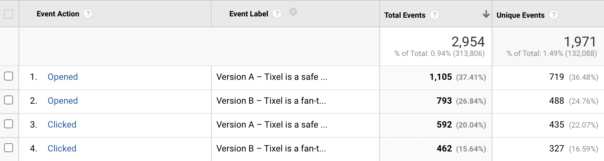

## Simple A/B testing

A very simple web A/B testing package for Laravel

## Installation

You can use Composer to install this package easily:
```bash
$ composer require tixelrocks/abtest
```

## Configuration

Configure your A/B experiments in `config/ab.php` file (not provided by default).
Let's say we have a button somewhere on our website and we want to see what's a better
call to action (text inside the button) - "Continue" or "Finish":


```php
<?php
// config/ab.php

return [
    [
        'control' => 'Continue',
        'treatment' => 'Finish',
        'name' => 'Purchase Button Test'
    ]
];
```

## Picking the variant

Some users will see "Continue" (A version or "control" version), some will see "Finish" (B variant or "treatment" variant), 
this will be decided on a per-user basis, roughly at a 1:1 ratio based on a cookie that's set during
the first visit by the `Tixel\AbTest\SetAbTestCookie` middleware that you can add to any
route or all routes:

```php
<?php
    // somewhere in app\Http\Kernel.php
    protected $middlewareGroups = [
        'web' => [
            SetAbTestCookie::class,
            ...
    ]
```

For easy local troubleshooting, you can also use a query parameter at any time:
```bash
$ curl http://localhost:8000/?abTest=treatment
```

## Usage in templates

Locate the button in your Blade template, and replace the button text with our helper function
or our Blade directive, passing the name of the A/B experiment from the config file:

```php
    <button>
        {{ abTest('Purchase Button Test') }}
    </button>
```

```php
    <button>
        @abTest('Purchase Button Test')
    </button>
```

Good! The text will now display as variant A and variant B depending on the user and the cookie in the browser,
but we need to track the results. This package currently ships with Google Analytics and Segment components, but it's
easy to add anything else.

Let's say we want to send an event to Google Analytics:

```php
   <button
    data-ga="event"
    data-event-category="{{ abTest('Purchase Button Test')->id() }}"
    data-event-action="Clicked"
    data-event-label="{{ abTest('Purchase Button Test')->description() }}"
   >
     @abTest('Purchase Button Test')
   </button>
```

We can add a global click handler that will send this to GA, from any button on any page:
```javascript
document.addEventListener('click', function (event) {
    var element = event.target.closest('[data-ga]');
    if (! element) return;
    if (element.getAttribute('data-ga') != 'event') return;
    var action = element.getAttribute('data-ga-action') || 'click';

    gtag('event', action, {
        'event_category': element.getAttribute('data-ga-category'),
        'event_label': element.getAttribute('data-ga-label'),
        'transport_type': 'beacon',
    });
}, false);
```

Okay, now we have data about how many users clicked on each variant - A or B, but to accurately
calculate conversion rates, it would be nice to see how many users SAW the variants A and B, so
let's send page view data as well:

```php
// Somewhere in our Blade template
<x-abtest-ga-event
    category="{{ abTest('Purchase Button Test')->id() }}"
    action="Opened"
    label="{{ abTest('Purchase Button Test')->description() }}"
></x-abtest-ga-event>
```

## Result



Now it's easy to see how many users are seeing each version and how many are clicking. In a few
weeks you can decide which option keep and which one to remove :)

## Managing tests

To see what's currently active, you can run a console command shipped with this package that will find
all uses of abTest() function in the templates:

```bash
$ php artisan abtest:find-files
Discovered a total of 23 view templates in /Users/user/resources/views
+---------------------------------------------+--------------------+----------------------+
| File                                        | A/B Test Name      | Lines                |
+---------------------------------------------+--------------------+----------------------+
| /resources/views/purchase/buy.blade.php     | Purchase Button Te | 52, 61, 63, 135, 137 |
+---------------------------------------------+--------------------+----------------------+
```

You can expose this as a route as well:
```php
Route::get('/ab', function () {
    Artisan::call('abtest:find-files');

    return '<pre>'. Artisan::output() . '</pre>';
});
```

To disable a test, either replace the `abTest()` function or `@abTest` directive
with plain-text or comment out one of the options in the config file.